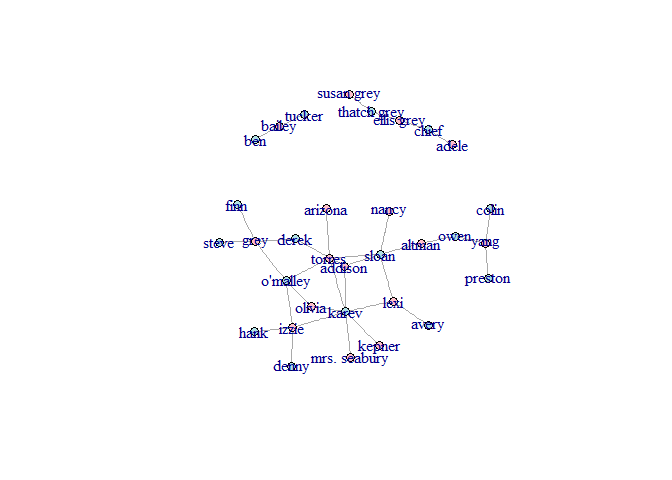
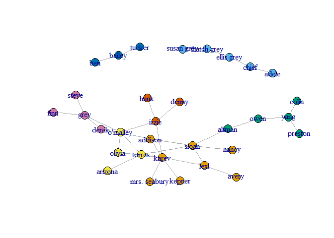
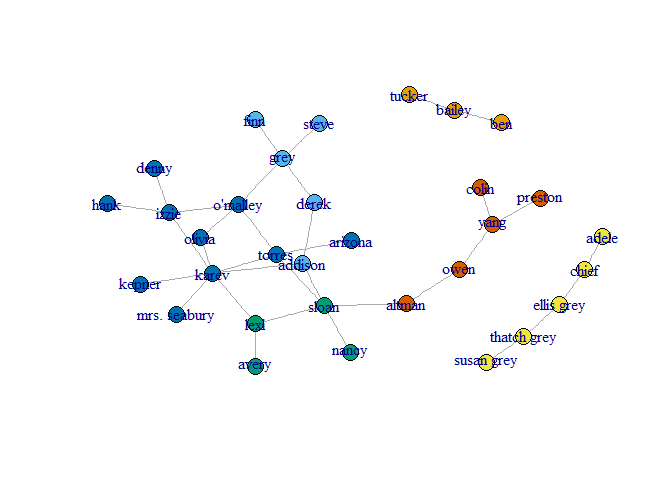
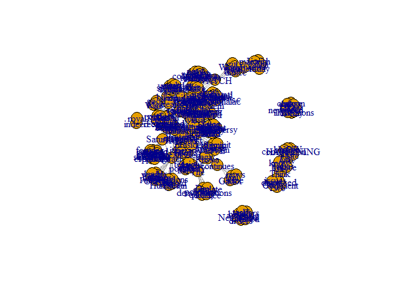
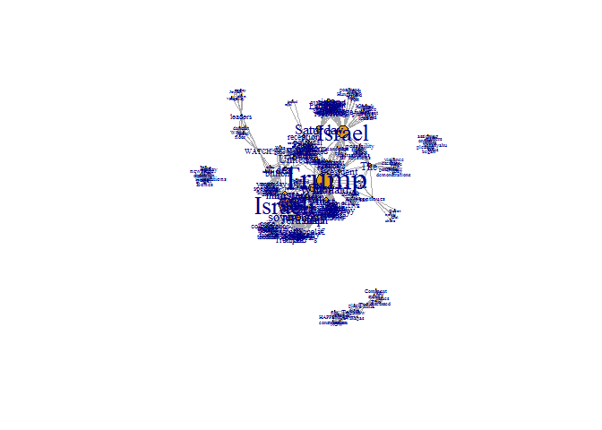
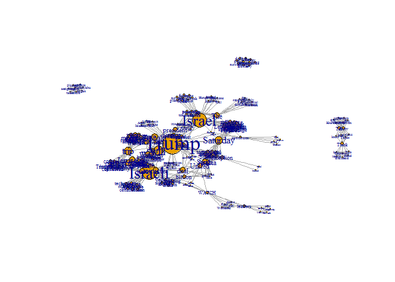
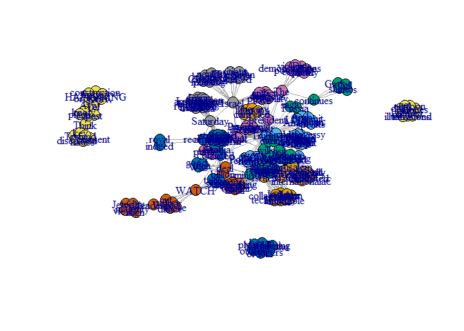
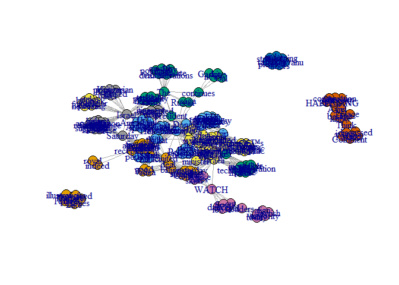

1a.
===

define root directiry and add library

Next, I will explore the data firther. In order to do so, let's
represent the data as a graph. edges - ga.data verices -
ge.data.vertices

    ga.data <- read.csv('C:/Users/User/Desktop/EX3/ga_edgelist.csv', header=T, stringsAsFactors=F)
    ga.data.vertices <- read.csv('C:/Users/User/Desktop/EX3/ga_actors.csv', header=T, stringsAsFactors=F)
    g <- graph.data.frame(ga.data, vertices=ga.data.vertices, directed=F)
    #let's explore it a bit
    g

    ## IGRAPH UN-- 32 34 -- 
    ## + attr: name (v/c), gender (v/c)
    ## + edges (vertex names):
    ##  [1] lexi    --sloan        karev   --lexi         owen    --yang        
    ##  [4] altman  --owen         sloan   --torres       altman  --sloan       
    ##  [7] arizona --torres       karev   --torres       derek   --grey        
    ## [10] izzie   --karev        izzie   --o'malley     o'malley--torres      
    ## [13] colin   --yang         preston --yang         karev   --kepner      
    ## [16] addison --sloan        addison --karev        addison --derek       
    ## [19] nancy   --sloan        karev   --olivia       olivia  --o'malley    
    ## [22] grey    --o'malley     karev   --mrs. seabury adele   --chief       
    ## + ... omitted several edges

IGRAPH UN-- 32 34 -- + attr: name (v/c), gender (v/c) + edges (vertex
names): \[1\] lexi --sloan karev --lexi owen --yang altman --owen  
\[5\] sloan --torres altman --sloan arizona --torres karev --torres  
\[9\] derek --grey izzie --karev izzie --o'malley o'malley --torres  
\[13\] colin --yang preston --yang karev --kepner addison --sloan  
\[17\] addison --karev addison --derek nancy --sloan karev --olivia  
\[21\] olivia --o'malley grey --o'malley karev --mrs. seabury adele
--chief  
\[25\] chief --ellis grey ellis grey--thatch grey susan grey--thatch
grey bailey --tucker  
\[29\] hank --izzie denny --izzie finn --grey grey --steve  
+ ... omitted several edges

We can see that there are 34 edges and 32 vertices on an undirected
graph. Let's use 'V(g)$gender' attribute to color the nodes by gender:

    V(g)$size <- 7 # Set size to all nodes
    V(g)$color <- "powderblue"
    females <- which(V(g)$gender == "F")
    V(g)$color[females] <- "pink" 
    plot(g)

betweeness
----------

For every pair of vertices in a connected graph, there exists at least
one shortest path between the vertices such that either the number of
edges that the path passes through (for unweighted graphs) or the sum of
the weights of the edges (for weighted graphs) is minimized. The
betweenness centrality for each vertex is the number of these shortest
paths that pass through the vertex. \#\#\# highest - sloan = 115.36667

    betweenness <- betweenness(g)
    betweenness <- sort(betweenness, decreasing = TRUE)
    betweenness

    ##        sloan        karev       altman       torres         owen 
    ##    115.36667     95.26667     76.00000     67.15000     60.00000 
    ##     o'malley        izzie         grey      addison         yang 
    ##     54.41667     47.95000     46.86667     44.08333     43.00000 
    ##         lexi        derek       olivia   ellis grey        chief 
    ##     36.00000     17.95000      4.95000      4.00000      3.00000 
    ##  thatch grey       bailey        adele      arizona        avery 
    ##      3.00000      1.00000      0.00000      0.00000      0.00000 
    ##          ben        colin        denny         finn         hank 
    ##      0.00000      0.00000      0.00000      0.00000      0.00000 
    ##       kepner mrs. seabury        nancy      preston        steve 
    ##      0.00000      0.00000      0.00000      0.00000      0.00000 
    ##   susan grey       tucker 
    ##      0.00000      0.00000

    sloan        karev       altman       torres         owen     o'malley        izzie         grey 

115.36667 95.26667 76.00000 67.15000 60.00000 54.41667 47.95000 46.86667
addison yang lexi derek olivia ellis grey chief thatch grey 44.08333
43.00000 36.00000 17.95000 4.95000 4.00000 3.00000 3.00000 bailey adele
arizona avery ben colin denny finn 1.00000 0.00000 0.00000 0.00000
0.00000 0.00000 0.00000 0.00000 hank kepner mrs. seabury nancy preston
steve susan grey tucker 0.00000 0.00000 0.00000 0.00000 0.00000 0.00000
0.00000 0.00000

Closeness
---------

Closeness is based on the length of the average shortest path between a
node and all other nodes in the network. \#\#\# highest - torres =
0.00319488

    closeness <- closeness(g, mode="all")
    closeness <- sort(closeness, decreasing = TRUE)
    closeness

    ##       torres      addison        karev        sloan     o'malley 
    ##  0.003194888  0.003174603  0.003174603  0.003174603  0.003134796 
    ##         lexi        izzie       altman        derek       olivia 
    ##  0.003115265  0.003076923  0.003039514  0.003039514  0.003039514 
    ##         grey      arizona       kepner mrs. seabury        nancy 
    ##  0.003003003  0.002985075  0.002967359  0.002967359  0.002967359 
    ##        avery         owen        denny         hank         finn 
    ##  0.002915452  0.002898551  0.002881844  0.002881844  0.002816901 
    ##        steve         yang        colin      preston   ellis grey 
    ##  0.002816901  0.002754821  0.002597403  0.002597403  0.001149425 
    ##        chief  thatch grey        adele   susan grey       bailey 
    ##  0.001148106  0.001148106  0.001144165  0.001144165  0.001075269 
    ##          ben       tucker 
    ##  0.001074114  0.001074114

torres addison karev sloan o'malley lexi izzie altman 0.003194888
0.003174603 0.003174603 0.003174603 0.003134796 0.003115265 0.003076923
0.003039514 derek olivia grey arizona kepner mrs. seabury nancy avery
0.003039514 0.003039514 0.003003003 0.002985075 0.002967359 0.002967359
0.002967359 0.002915452 owen denny hank finn steve yang colin preston
0.002898551 0.002881844 0.002881844 0.002816901 0.002816901 0.002754821
0.002597403 0.002597403 ellis grey chief thatch grey adele susan grey
bailey ben tucker 0.001149425 0.001148106 0.001148106 0.001144165
0.001144165 0.001075269 0.001074114 0.001074114

Eigenvector
-----------

How central you are depends on how central your neighbors are. \#\#\#
highest - kerev = 1

    Eigenvector <- eigen_centrality(g, directed = TRUE, scale = TRUE)
    Eigenvector <- sort(Eigenvector$vector, decreasing = TRUE)
    Eigenvector

    ##        karev       torres        sloan     o'malley        izzie 
    ## 1.000000e+00 7.178773e-01 6.418121e-01 6.006975e-01 5.653959e-01 
    ##      addison         lexi       olivia         grey       kepner 
    ## 5.537364e-01 5.255806e-01 4.685192e-01 3.004927e-01 2.926969e-01 
    ## mrs. seabury        derek      arizona       altman        nancy 
    ## 2.926969e-01 2.500302e-01 2.101205e-01 2.077024e-01 1.878564e-01 
    ##        denny         hank        avery         finn        steve 
    ## 1.654896e-01 1.654896e-01 1.538358e-01 8.795329e-02 8.795329e-02 
    ##         owen         yang        colin      preston        chief 
    ## 6.780381e-02 2.394956e-02 7.009961e-03 7.009961e-03 8.110996e-17 
    ##   ellis grey  thatch grey       bailey        adele   susan grey 
    ## 6.964701e-17 3.347235e-17 2.775140e-17 2.698611e-17 1.790875e-17 
    ##       tucker          ben 
    ## 1.719758e-17 7.352822e-18

karev torres sloan o'malley izzie addison lexi olivia 1.000000e+00
7.178773e-01 6.418121e-01 6.006975e-01 5.653959e-01 5.537364e-01
5.255806e-01 4.685192e-01 grey kepner mrs. seabury derek arizona altman
nancy hank 3.004927e-01 2.926969e-01 2.926969e-01 2.500302e-01
2.101205e-01 2.077024e-01 1.878564e-01 1.654896e-01 denny avery finn
steve owen yang preston colin 1.654896e-01 1.538358e-01 8.795329e-02
8.795329e-02 6.780381e-02 2.394956e-02 7.009961e-03 7.009961e-03 chief
thatch grey ellis grey bailey adele susan grey tucker ben 1.396984e-16
1.106333e-16 1.019063e-16 9.115267e-17 5.448438e-17 5.320735e-17
4.583473e-17 3.766439e-17 \# 1b.

Girvan-Newman - edge betweeness community Clustering
----------------------------------------------------

we got 7 groups

    gnc <-  edge.betweenness.community(g, directed = FALSE)
    gnc_plot <- membership(gnc)
    gnc

    ## IGRAPH clustering edge betweenness, groups: 7, mod: 0.58
    ## + groups:
    ##   $`1`
    ##   [1] "addison"      "avery"        "karev"        "kepner"      
    ##   [5] "lexi"         "mrs. seabury" "nancy"        "sloan"       
    ##   
    ##   $`2`
    ##   [1] "adele"       "chief"       "ellis grey"  "susan grey"  "thatch grey"
    ##   
    ##   $`3`
    ##   [1] "altman"  "colin"   "owen"    "preston" "yang"   
    ##   
    ##   + ... omitted several groups/vertices

    plot(g, vertex.size=7, vertex.color=gnc_plot, asp=FALSE)

To get the size of each group, we will do: 8,5,5,4,3,3,4

    sizes(gnc)

    ## Community sizes
    ## 1 2 3 4 5 6 7 
    ## 8 5 5 4 3 3 4

### Modularity Score

= 0.5774221

    max(gnc$modularity)

    ## [1] 0.5774221

Louvain Clustering
------------------

We got 6 groups

    lo <- cluster_louvain(g)
    lo_plot <-membership(lo)
    lo

    ## IGRAPH clustering multi level, groups: 6, mod: 0.59
    ## + groups:
    ##   $`1`
    ##   [1] "bailey" "ben"    "tucker"
    ##   
    ##   $`2`
    ##   [1] "addison" "derek"   "finn"    "grey"    "steve"  
    ##   
    ##   $`3`
    ##   [1] "avery" "lexi"  "nancy" "sloan"
    ##   
    ##   $`4`
    ##   + ... omitted several groups/vertices

    plot(g,vertex.size=7 , vertex.color=lo_plot , asp=FALSE)

To get the size of each group, we will do: 3,5,4,5,10,5

    sizes(lo)

    ## Community sizes
    ##  1  2  3  4  5  6 
    ##  3  5  4  5 10  5

### Modularity Score

= 0.5947232

    max(lo$modularity)

    ## [1] 0.5947232

2a.
===

Facebook
--------

Setting credentials. I chose the Facebook page of Jerusalem and took 30
posts up until 22th of may.

    #install.packages("devtools")
    library(devtools)
    #install_github("Rfacebook", "pablobarbera", subdir="Rfacebook")
    require (Rfacebook)

    ## Loading required package: Rfacebook

    ## Loading required package: httr

    ## Loading required package: rjson

    ## Loading required package: httpuv

    ## 
    ## Attaching package: 'Rfacebook'

    ## The following object is masked from 'package:methods':
    ## 
    ##     getGroup

    token <- "EAACEdEose0cBAGdDLYyAdodI4XDWxChmDsaK0Bf0yyragG3926qAZCZBcJAvJEq9Xmd0bFib12Q7zSNNyalTXRFdfWc9ZBiPO1VnwCkRoAKNjY6mZCI9xxAM4VKEd0DTZAcoClU12xVRojB4XrIj14yBrwYkAmdq0v3IzDiZCo7ZB7RWBqhoqgXisXgDeqtaZAcZD"

    fb_page <- getPage('TheJerusalemPost', token, n = 30, since = NULL, until =  "2017-05-22", feed = TRUE,  reactions = FALSE)

    ## 25 posts 50 posts

    fb_page 

    ##            from_id                      from_name
    ## 1  159050394216641 The Jerusalem Post / JPost.com
    ## 2  159050394216641 The Jerusalem Post / JPost.com
    ## 3  159050394216641 The Jerusalem Post / JPost.com
    ## 4  159050394216641 The Jerusalem Post / JPost.com
    ## 5  159050394216641 The Jerusalem Post / JPost.com
    ## 6  159050394216641 The Jerusalem Post / JPost.com
    ## 7  159050394216641 The Jerusalem Post / JPost.com
    ## 8  159050394216641 The Jerusalem Post / JPost.com
    ## 9  159050394216641 The Jerusalem Post / JPost.com
    ## 10 159050394216641 The Jerusalem Post / JPost.com
    ## 11 159050394216641 The Jerusalem Post / JPost.com
    ## 12 159050394216641 The Jerusalem Post / JPost.com
    ## 13 159050394216641 The Jerusalem Post / JPost.com
    ## 14 159050394216641 The Jerusalem Post / JPost.com
    ## 15 159050394216641 The Jerusalem Post / JPost.com
    ## 16 159050394216641 The Jerusalem Post / JPost.com
    ## 17 159050394216641 The Jerusalem Post / JPost.com
    ## 18 159050394216641 The Jerusalem Post / JPost.com
    ## 19 159050394216641 The Jerusalem Post / JPost.com
    ## 20 159050394216641 The Jerusalem Post / JPost.com
    ## 21 159050394216641 The Jerusalem Post / JPost.com
    ## 22 159050394216641 The Jerusalem Post / JPost.com
    ## 23 159050394216641 The Jerusalem Post / JPost.com
    ## 24 159050394216641 The Jerusalem Post / JPost.com
    ## 25 159050394216641 The Jerusalem Post / JPost.com
    ## 26 159050394216641 The Jerusalem Post / JPost.com
    ## 27 159050394216641 The Jerusalem Post / JPost.com
    ## 28 159050394216641 The Jerusalem Post / JPost.com
    ## 29 159050394216641 The Jerusalem Post / JPost.com
    ## 30 159050394216641 The Jerusalem Post / JPost.com
    ##                                                                                                                                                                         message
    ## 1                 Trump<U+0092>s trip comes as the issue of Israeli sovereignty over Jerusalem in general and the Old City specifically has been hotly contested by the international<U+0085>
    ## 2                                                                <U+0093>The Temple Mount and the Western Wall will always remain under Israeli sovereignty,<U+0094> the prime minister said.
    ## 3                                                                                               Pollard could be Trump's ticket to redemption in the eyes of the Israeli right.
    ## 4                                                                                      Today's cartoon by Dry Bones\nLike the page to get daily illustrations on your newsfeed.
    ## 5                                                                                                                      Was the $350 billion deal with Saudi Arabia a good idea?
    ## 6                                                                        What do you think of the gift President Donald J. Trump will receive from Israel's Holocaust memorial?
    ## 7                                                                                                                  Trump has canceled two stops on his Israel itinerary so far.
    ## 8                                                                                                                        LIVE: Trump speaks at the Arab Islamic American Summit
    ## 9                                                                                  One Israeli minister is speaking out on the multi-billion dollar arms deal signed yesterday.
    ## 10                                                                                         In other news, Gal Gadot continues to shine <ed><U+00A0><U+00BC><ed><U+00BC><U+009F>
    ## 11                                               A huge collaboration between Israeli technology and the Indian navy was just made public, and the price sticker is incredible.
    ## 12                                                     A dinner was scheduled in Jerusalem during Trump's visit, but it was just announced that it will no longer be happening.
    ## 13                                                                                                     HAPPENING NOW: A fire has broken out at a construction site in Tel Aviv.
    ## 14                                                                        Netanyahu has began assigning orders to staffers, some are more pleased than others with their tasks.
    ## 15                                                                                                                               WATCH: United allies take to the Israeli skies
    ## 16                                                                              Two key issues stand out for the PM. Think there's other issues to be discussed? Comment below.
    ## 17                                                                                                                            WATCH: World leaders cut loose on the dance floor
    ## 18                                                                                                             Do your views align with the majority of today's Jewish leaders?
    ## 19                                                                                                                Think you know the best place in Tel Aviv for the best Tapas?
    ## 20                                                                                                                 What do you think of the 'perfect deal' to end the conflict?
    ## 21                                                                                                 Trump will be the first sitting US president to ever visit the Western Wall.
    ## 22                                                           "I feel that both in the UN and the EU there are biased positions against Israel," the Hungarian FM told the Post.
    ## 23                                                                          The possibility is still intact as tensions flare up a day before the US president lands in Israel.
    ## 24 An Iraqi citizen was arrested in Lebanon on suspicion of spying on the Lebanese military and forming an espionage ring at Israel's behest, Lebanese media reported Saturday.
    ## 25                                                                                                                                                    A royal reception indeed.
    ## 26                  While the controversy over the abrupt firing of FBI head James Comey refuses to die down in the US, Donald J. Trump makes the first stop of his trip count.
    ## 27                                                                                       The "Day of Rage" demonstrations have the potential to quickly escalate into violence.
    ## 28                              Trump won a warm reception in Saudi Arabia on Saturday but struggled to shift attention from the political firestorm back in the United States.
    ## 29                                                                                                                                             The Trump-Russia saga continues.
    ## 30                                                                                               Check out the newest world leader planting a stake of hope in Israel's future.
    ##                created_time  type
    ## 1  2017-05-21T23:29:17+0000  link
    ## 2  2017-05-21T21:31:26+0000  link
    ## 3  2017-05-21T18:57:26+0000  link
    ## 4  2017-05-21T17:32:00+0000 photo
    ## 5  2017-05-21T16:52:56+0000  link
    ## 6  2017-05-21T15:22:13+0000  link
    ## 7  2017-05-21T14:54:12+0000  link
    ## 8  2017-05-21T14:27:08+0000  link
    ## 9  2017-05-21T13:35:41+0000  link
    ## 10 2017-05-21T13:07:24+0000  link
    ## 11 2017-05-21T12:33:46+0000  link
    ## 12 2017-05-21T12:01:08+0000  link
    ## 13 2017-05-21T11:34:00+0000  link
    ## 14 2017-05-21T11:07:04+0000  link
    ## 15 2017-05-21T10:25:42+0000  link
    ## 16 2017-05-21T09:49:04+0000  link
    ## 17 2017-05-21T08:58:38+0000 video
    ## 18 2017-05-21T08:04:27+0000  link
    ## 19 2017-05-21T07:24:25+0000  link
    ## 20 2017-05-21T06:45:53+0000  link
    ## 21 2017-05-21T05:01:27+0000  link
    ## 22 2017-05-21T03:09:05+0000  link
    ## 23 2017-05-21T01:01:12+0000  link
    ## 24 2017-05-20T23:16:26+0000  link
    ## 25 2017-05-20T21:44:16+0000  link
    ## 26 2017-05-20T20:52:34+0000  link
    ## 27 2017-05-20T17:54:33+0000  link
    ## 28 2017-05-20T15:44:00+0000  link
    ## 29 2017-05-20T14:46:31+0000  link
    ## 30 2017-05-20T13:11:00+0000  link
    ##                                                                                                                                                link
    ## 1                             http://www.jpost.com/Arab-Israeli-Conflict/Analysis-Why-a-photo-op-of-PM-and-Trump-at-the-Western-Wall-matters-492477
    ## 2                              http://www.jpost.com/Israel-News/Netanyahu-ahead-of-Trump-visit-Israel-didnt-occupy-Jerusalem-we-liberated-it-492474
    ## 3                            http://www.jpost.com/Israel-News/Politics-And-Diplomacy/Pollard-to-Netanyahu-Dont-forget-me-in-talks-with-Trump-492463
    ## 4                                 https://www.facebook.com/TheJerusalemPost/photos/a.167063636748650.35351.159050394216641/1433135113474823/?type=3
    ## 5             http://www.jpost.com/Israel-News/Politics-And-Diplomacy/Ministers-concerned-Saudi-arms-deal-might-affect-Israels-military-edge-492447
    ## 6                                       http://www.jpost.com/Israel-News/Yad-Vashem-to-present-President-Trump-with-unique-personal-artifact-492415
    ## 7                                                  http://www.jpost.com/Arab-Israeli-Conflict/Will-Trump-visit-Bethlehems-Church-of-Nativity-492426
    ## 8                                    http://www.jpost.com/Middle-East/Watch-Trump-tells-Middle-East-step-up-in-fight-over-Islamist-extremism-492431
    ## 9                              http://www.jpost.com/Israel-News/Politics-And-Diplomacy/Israeli-minister-US-Saudi-arms-deal-should-trouble-us-492423
    ## 10                                                                         http://www.jpost.com/Not-Just-News/The-meteoric-rise-of-Gal-Gadot-492352
    ## 11                               http://www.jpost.com/Israel-News/Politics-And-Diplomacy/Israeli-firm-inks-630-million-deal-with-Indian-navy-492409
    ## 12                                                       http://www.jpost.com/Israel-News/US-cancels-festive-King-David-dinner-with-Israelis-492406
    ## 13                                                                             http://www.jpost.com/Israel-News/Fire-rages-at-Tel-Aviv-tower-492403
    ## 14        http://www.jpost.com/Israel-News/Politics-And-Diplomacy/Netanyahu-orders-reluctant-ministers-to-greet-Trump-upon-arrival-in-Israel-492402
    ## 15                          http://www.jpost.com/Israel-News/Politics-And-Diplomacy/American-Israeli-air-forces-complete-two-week-long-drill-492396
    ## 16                                  http://www.jpost.com/Israel-News/Politics-And-Diplomacy/Netanyahu-Ill-talk-security-and-peace-with-Trump-492394
    ## 17                                                                               https://www.facebook.com/TheJerusalemPost/videos/1432817473506587/
    ## 18 http://www.jpost.com/Israel-News/Politics-And-Diplomacy/Majority-of-Jewish-leaders-in-diaspora-in-favor-of-moving-US-embassy-to-Jerusalem-492387
    ## 19                                                                               http://www.jpost.com/Israel-News/Culture/Top-Tel-Aviv-tapas-492139
    ## 20                                                           http://www.jpost.com/Arab-Israeli-Conflict/The-perfect-deal-to-end-the-conflict-492363
    ## 21                                               http://www.jpost.com/Israel-News/Politics-And-Diplomacy/Trumps-Israel-visit-All-the-details-492383
    ## 22                                  http://www.jpost.com/Israel-News/Politics-And-Diplomacy/Hungarian-FM-We-oppose-anti-Israel-bias-in-UN-EU-492366
    ## 23                                                                    http://www.jpost.com/Israel-News/Trump-may-let-PM-visit-Kotel-with-him-492367
    ## 24                     http://www.jpost.com/Middle-East/Report-Lebanon-allegedly-detains-Iraqi-citizen-accused-of-gathering-intel-for-Israel-492360
    ## 25                       http://www.jpost.com/Middle-East/WATCH-When-Trump-isnt-signing-an-arms-deal-in-Saudi-Arabia-hes-dancing-with-swords-492357
    ## 26                                                 http://www.jpost.com/Middle-East/Royal-treatment-for-Trump-in-Riyadh-amid-turmoil-at-home-492356
    ## 27                                 http://www.jpost.com/Arab-Israeli-Conflict/Palestinian-factions-call-for-A-Day-of-Rage-during-Trump-visit-492344
    ## 28                                             http://www.jpost.com/Middle-East/US-signs-110-bil-arms-deal-as-Trump-comes-under-fire-at-home-492335
    ## 29                            http://www.jpost.com/American-Politics/Is-Jared-Kushner-a-person-of-interest-in-the-Trump-Russia-investigation-492329
    ## 30                                    http://www.jpost.com/Green-Israel/President-of-the-Central-African-Republic-Plants-a-Tree-in-Jerusalem-492123
    ##                                  id story likes_count comments_count
    ## 1  159050394216641_1433642016757466  <NA>          75             11
    ## 2  159050394216641_1433536563434678  <NA>        2325             91
    ## 3  159050394216641_1433392040115797  <NA>         145             19
    ## 4  159050394216641_1433135113474823  <NA>        1009             47
    ## 5  159050394216641_1433260270128974  <NA>         122             82
    ## 6  159050394216641_1433131736808494  <NA>         159             71
    ## 7  159050394216641_1433132456808422  <NA>         157             64
    ## 8  159050394216641_1433105820144419  <NA>          73              7
    ## 9  159050394216641_1433051906816477  <NA>          91             36
    ## 10 159050394216641_1433016713486663  <NA>         138              6
    ## 11 159050394216641_1432987846822883  <NA>         391              8
    ## 12 159050394216641_1432960493492285  <NA>         366            124
    ## 13 159050394216641_1432923290162672  <NA>          84              3
    ## 14 159050394216641_1432911033497231  <NA>          81             28
    ## 15 159050394216641_1432885090166492  <NA>         324             11
    ## 16 159050394216641_1432851806836487  <NA>          76             12
    ## 17 159050394216641_1432817473506587  <NA>         985            213
    ## 18 159050394216641_1432784883509846  <NA>          56             14
    ## 19 159050394216641_1432751830179818  <NA>          50              4
    ## 20 159050394216641_1432726166849051  <NA>          81             48
    ## 21 159050394216641_1432655906856077  <NA>        1002             59
    ## 22 159050394216641_1432576413530693  <NA>         502             27
    ## 23 159050394216641_1432484860206515  <NA>         130             65
    ## 24 159050394216641_1432409420214059  <NA>          39             12
    ## 25 159050394216641_1432343186887349  <NA>         181             41
    ## 26 159050394216641_1432292706892397  <NA>         108             32
    ## 27 159050394216641_1432131296908538  <NA>         122            152
    ## 28 159050394216641_1431984653589869  <NA>          72             41
    ## 29 159050394216641_1431964000258601  <NA>          43             48
    ## 30 159050394216641_1429692333819101  <NA>         273              8
    ##    shares_count
    ## 1            21
    ## 2           534
    ## 3            23
    ## 4           644
    ## 5            52
    ## 6            31
    ## 7            68
    ## 8            27
    ## 9            48
    ## 10           15
    ## 11           71
    ## 12          193
    ## 13           30
    ## 14           16
    ## 15           28
    ## 16           13
    ## 17          391
    ## 18           12
    ## 19            6
    ## 20           24
    ## 21          208
    ## 22           58
    ## 23           16
    ## 24           33
    ## 25           27
    ## 26           12
    ## 27          164
    ## 28           14
    ## 29            9
    ## 30           34

Let's keep the messages and take a look at them

    #install.packages(tm)
    #install.packages(httr)
    #install.packages("slam")
    library(tm)

    ## Loading required package: NLP

    ## 
    ## Attaching package: 'NLP'

    ## The following object is masked from 'package:httr':
    ## 
    ##     content

    library(httr)

    data_posts <- Corpus(VectorSource(fb_page$message))
    data_posts

    ## <<SimpleCorpus>>
    ## Metadata:  corpus specific: 1, document level (indexed): 0
    ## Content:  documents: 30

Let's clean and clear the messages a bit and perform better our data as
a matrix

    term_matrix <- TermDocumentMatrix(data_posts, control = list(removeNumbers=TRUE, removePunctuation=TRUE,stopwords=TRUE,tolower = FALSE)) 
    term_matrix

    ## <<TermDocumentMatrix (terms: 219, documents: 30)>>
    ## Non-/sparse entries: 269/6301
    ## Sparsity           : 96%
    ## Maximal term length: 15
    ## Weighting          : term frequency (tf)

    term_matrix <- as.matrix(term_matrix)
    term_matrix[0:15,]

    ##                  Docs
    ## Terms             1 2 3 4 5 6 7 8 9 10 11 12 13 14 15 16 17 18 19 20 21 22
    ##   City            1 0 0 0 0 0 0 0 0  0  0  0  0  0  0  0  0  0  0  0  0  0
    ##   Israeli         1 1 1 0 0 0 0 0 1  0  1  0  0  0  1  0  0  0  0  0  0  0
    ##   Jerusalem       1 0 0 0 0 0 0 0 0  0  0  1  0  0  0  0  0  0  0  0  0  0
    ##   Old             1 0 0 0 0 0 0 0 0  0  0  0  0  0  0  0  0  0  0  0  0  0
    ##   Trumpâ<U+0080><U+0099>s       1 0 0 0 0 0 0 0 0  0  0  0  0  0  0  0  0  0  0  0  0  0
    ##   comes           1 0 0 0 0 0 0 0 0  0  0  0  0  0  0  0  0  0  0  0  0  0
    ##   contested       1 0 0 0 0 0 0 0 0  0  0  0  0  0  0  0  0  0  0  0  0  0
    ##   general         1 0 0 0 0 0 0 0 0  0  0  0  0  0  0  0  0  0  0  0  0  0
    ##   hotly           1 0 0 0 0 0 0 0 0  0  0  0  0  0  0  0  0  0  0  0  0  0
    ##   internationalâ<U+0080> 1 0 0 0 0 0 0 0 0  0  0  0  0  0  0  0  0  0  0  0  0  0
    ##   issue           1 0 0 0 0 0 0 0 0  0  0  0  0  0  0  0  0  0  0  0  0  0
    ##   sovereignty     1 1 0 0 0 0 0 0 0  0  0  0  0  0  0  0  0  0  0  0  0  0
    ##   specifically    1 0 0 0 0 0 0 0 0  0  0  0  0  0  0  0  0  0  0  0  0  0
    ##   trip            1 0 0 0 0 0 0 0 0  0  0  0  0  0  0  0  0  0  0  0  0  0
    ##   Mount           0 1 0 0 0 0 0 0 0  0  0  0  0  0  0  0  0  0  0  0  0  0
    ##                  Docs
    ## Terms             23 24 25 26 27 28 29 30
    ##   City             0  0  0  0  0  0  0  0
    ##   Israeli          0  0  0  0  0  0  0  0
    ##   Jerusalem        0  0  0  0  0  0  0  0
    ##   Old              0  0  0  0  0  0  0  0
    ##   Trumpâ<U+0080><U+0099>s        0  0  0  0  0  0  0  0
    ##   comes            0  0  0  0  0  0  0  0
    ##   contested        0  0  0  0  0  0  0  0
    ##   general          0  0  0  0  0  0  0  0
    ##   hotly            0  0  0  0  0  0  0  0
    ##   internationalâ<U+0080>  0  0  0  0  0  0  0  0
    ##   issue            0  0  0  0  0  0  0  0
    ##   sovereignty      0  0  0  0  0  0  0  0
    ##   specifically     0  0  0  0  0  0  0  0
    ##   trip             0  0  0  1  0  0  0  0
    ##   Mount            0  0  0  0  0  0  0  0

Now, let's create the graph

    #install.packages("igraph")
    library(igraph)

    net <- graph.incidence(term_matrix)
    proj_net <- bipartite.projection(net)
    net <- proj_net$proj1
    #set.seed(3952)
    plot(net)

and beautify it a bit

    degree_s<-degree(net)
    V(net)$label <- V(net)$name
    V(net)$size = degree(net)
    V(net)$size <- degree_s * 0.2
    V(net)$label.cex<-  2 * V(net)$size / max(V(net)$size) +.2
    plot(net)

    #install.packages('wordcloud')
    #install.packages(' RColorBrewer')
    library(wordcloud)

    ## Loading required package: RColorBrewer

    library(RColorBrewer)
    #Layout<-layout_with_kk(net)
    #Layout<-layout_with_lgl(net)
    #Layout<-layout_nicely(net)
    plot(net, asp=FALSE)

    summary(net)

    ## IGRAPH UNW- 219 1230 -- 
    ## + attr: name (v/c), label (v/c), size (v/n), label.cex (v/n),
    ## | weight (e/n)

    #tkplot(net, layout=Layout)

Now, I will answer question 1 a again and will find Bteweennes, Closeness and Eigenvector
-----------------------------------------------------------------------------------------

### Betweeness, Trump = 6.138410e+03

    betweenness<-betweenness(net)
    betweenness = sort(betweenness, decreasing = TRUE)
    betweenness

    ##           Trump         Israeli          Israel           WATCH 
    ##    6.138410e+03    4.077899e+03    3.878596e+03    1.870000e+03 
    ##            will             The        Saturday          United 
    ##    1.726098e+03    1.607538e+03    1.525104e+03    1.122630e+03 
    ##         leaders       continues       president            trip 
    ##    8.800000e+02    7.080000e+02    6.410123e+02    6.331681e+02 
    ##            just            deal          Donald       Jerusalem 
    ##    5.479846e+02    5.241984e+02    5.095333e+02    3.653900e+02 
    ##       reception            What           think          Arabia 
    ##    3.580526e+02    2.784443e+02    2.784443e+02    2.725296e+02 
    ##           Saudi            Wall         Western        minister 
    ##    2.725296e+02    2.658645e+02    2.658645e+02    1.840922e+02 
    ##     sovereignty         billion           first           Think 
    ##    1.731730e+02    1.542229e+02    1.309380e+02    7.208333e+01 
    ##           visit            Aviv             Tel       Holocaust 
    ##    4.485578e+01    3.300000e+01    3.300000e+01    1.393411e+01 
    ##       President            gift        memorial         receive 
    ##    1.393411e+01    1.393411e+01    1.393411e+01    1.393411e+01 
    ##        canceled             far       itinerary           stops 
    ##    1.097426e+01    1.097426e+01    1.097426e+01    1.097426e+01 
    ##             two            ever         sitting       announced 
    ##    1.097426e+01    7.450663e+00    7.450663e+00    5.272456e+00 
    ##          dinner       happening          longer       scheduled 
    ##    5.272456e+00    5.272456e+00    5.272456e+00    5.272456e+00 
    ##           Comey             FBI           James           While 
    ##    3.470253e+00    3.470253e+00    3.470253e+00    3.470253e+00 
    ##          abrupt     controversy           count             die 
    ##    3.470253e+00    3.470253e+00    3.470253e+00    3.470253e+00 
    ##          firing            head           makes         refuses 
    ##    3.470253e+00    3.470253e+00    3.470253e+00    3.470253e+00 
    ##            stop           Mount          Temple          always 
    ##    3.470253e+00    2.917002e+00    2.917002e+00    2.917002e+00 
    ##           prime          remain            said          â<U+0080><U+009C>The 
    ##    2.917002e+00    2.917002e+00    2.917002e+00    2.917002e+00 
    ##             â<U+0080>             One            arms          dollar 
    ##    2.917002e+00    1.837545e+00    1.837545e+00    1.837545e+00 
    ##           multi          signed        speaking       yesterday 
    ##    1.837545e+00    1.837545e+00    1.837545e+00    1.837545e+00 
    ##            City             Old       Trumpâ<U+0080><U+0099>s           comes 
    ##    1.265568e+00    1.265568e+00    1.265568e+00    1.265568e+00 
    ##       contested         general           hotly internationalâ<U+0080> 
    ##    1.265568e+00    1.265568e+00    1.265568e+00    1.265568e+00 
    ##           issue    specifically             Was            good 
    ##    1.265568e+00    1.265568e+00    4.192982e-01    4.192982e-01 
    ##            idea       HAPPENING             NOW          broken 
    ##    4.192982e-01    8.333333e-02    8.333333e-02    8.333333e-02 
    ##    construction            fire            site           Tapas 
    ##    8.333333e-02    8.333333e-02    8.333333e-02    8.333333e-02 
    ##            best            know           place        conflict 
    ##    8.333333e-02    8.333333e-02    8.333333e-02    7.142857e-02 
    ##             end         perfect          States       attention 
    ##    7.142857e-02    7.142857e-02    5.263158e-02    5.263158e-02 
    ##            back       firestorm       political           shift 
    ##    5.263158e-02    5.263158e-02    5.263158e-02    5.263158e-02 
    ##       struggled            warm             won         Pollard 
    ##    5.263158e-02    5.263158e-02    5.263158e-02    0.000000e+00 
    ##            eyes      redemption           right          ticket 
    ##    0.000000e+00    0.000000e+00    0.000000e+00    0.000000e+00 
    ##           Bones             Dry            Like           Today 
    ##    0.000000e+00    0.000000e+00    0.000000e+00    0.000000e+00 
    ##         cartoon           daily             get   illustrations 
    ##    0.000000e+00    0.000000e+00    0.000000e+00    0.000000e+00 
    ##        newsfeed            page        American            Arab 
    ##    0.000000e+00    0.000000e+00    0.000000e+00    0.000000e+00 
    ##         Islamic            LIVE          Summit          speaks 
    ##    0.000000e+00    0.000000e+00    0.000000e+00    0.000000e+00 
    ##           Gadot             Gal            news           shine 
    ##    0.000000e+00    0.000000e+00    0.000000e+00    0.000000e+00 
    ##          Indian   collaboration            huge      incredible 
    ##    0.000000e+00    0.000000e+00    0.000000e+00    0.000000e+00 
    ##            made            navy           price          public 
    ##    0.000000e+00    0.000000e+00    0.000000e+00    0.000000e+00 
    ##         sticker      technology       Netanyahu       assigning 
    ##    0.000000e+00    0.000000e+00    0.000000e+00    0.000000e+00 
    ##           began          orders          others         pleased 
    ##    0.000000e+00    0.000000e+00    0.000000e+00    0.000000e+00 
    ##        staffers           tasks          allies           skies 
    ##    0.000000e+00    0.000000e+00    0.000000e+00    0.000000e+00 
    ##            take         Comment             Two       discussed 
    ##    0.000000e+00    0.000000e+00    0.000000e+00    0.000000e+00 
    ##          issues             key           stand           World 
    ##    0.000000e+00    0.000000e+00    0.000000e+00    0.000000e+00 
    ##             cut           dance           floor           loose 
    ##    0.000000e+00    0.000000e+00    0.000000e+00    0.000000e+00 
    ##          Jewish           align        majority           today 
    ##    0.000000e+00    0.000000e+00    0.000000e+00    0.000000e+00 
    ##           views       Hungarian            Post          biased 
    ##    0.000000e+00    0.000000e+00    0.000000e+00    0.000000e+00 
    ##            feel       positions            told             day 
    ##    0.000000e+00    0.000000e+00    0.000000e+00    0.000000e+00 
    ##           flare          intact           lands     possibility 
    ##    0.000000e+00    0.000000e+00    0.000000e+00    0.000000e+00 
    ##           still        tensions           Iraqi        Lebanese 
    ##    0.000000e+00    0.000000e+00    0.000000e+00    0.000000e+00 
    ##         Lebanon        arrested          behest         citizen 
    ##    0.000000e+00    0.000000e+00    0.000000e+00    0.000000e+00 
    ##       espionage         forming           media        military 
    ##    0.000000e+00    0.000000e+00    0.000000e+00    0.000000e+00 
    ##        reported            ring          spying       suspicion 
    ##    0.000000e+00    0.000000e+00    0.000000e+00    0.000000e+00 
    ##          indeed           royal             Day            Rage 
    ##    0.000000e+00    0.000000e+00    0.000000e+00    0.000000e+00 
    ##  demonstrations        escalate       potential         quickly 
    ##    0.000000e+00    0.000000e+00    0.000000e+00    0.000000e+00 
    ##        violence          Russia            saga           Check 
    ##    0.000000e+00    0.000000e+00    0.000000e+00    0.000000e+00 
    ##          future            hope          leader          newest 
    ##    0.000000e+00    0.000000e+00    0.000000e+00    0.000000e+00 
    ##        planting           stake           world 
    ##    0.000000e+00    0.000000e+00    0.000000e+00

### Closness , Israel = 1.186662e-04

    closeness<-closeness(net)
    closeness = sort(closeness, decreasing = TRUE)
    closeness

    ##           Trump         Israeli          United          Israel 
    ##    1.186662e-04    1.181474e-04    1.177718e-04    1.177579e-04 
    ##            will        Saturday            trip            Wall 
    ##    1.177440e-04    1.175779e-04    1.175641e-04    1.174950e-04 
    ##         Western       Jerusalem            just            What 
    ##    1.174950e-04    1.174674e-04    1.174398e-04    1.173985e-04 
    ##           think       president             The          Arabia 
    ##    1.173985e-04    1.173709e-04    1.173296e-04    1.172608e-04 
    ##           Saudi       Holocaust       President            gift 
    ##    1.172608e-04    1.172196e-04    1.172196e-04    1.172196e-04 
    ##        memorial         receive          Donald       reception 
    ##    1.172196e-04    1.172196e-04    1.171097e-04    1.170823e-04 
    ##          States       attention            back       firestorm 
    ##    1.170549e-04    1.170549e-04    1.170549e-04    1.170549e-04 
    ##       political           shift       struggled            warm 
    ##    1.170549e-04    1.170549e-04    1.170549e-04    1.170549e-04 
    ##             won         Pollard            eyes      redemption 
    ##    1.170549e-04    1.169727e-04    1.169727e-04    1.169727e-04 
    ##           right          ticket        canceled             far 
    ##    1.169727e-04    1.169727e-04    1.169591e-04    1.169591e-04 
    ##       itinerary           stops             two       announced 
    ##    1.169591e-04    1.169591e-04    1.169591e-04    1.169591e-04 
    ##          dinner       happening          longer       scheduled 
    ##    1.169591e-04    1.169591e-04    1.169591e-04    1.169591e-04 
    ##            deal           Comey             FBI           James 
    ##    1.168361e-04    1.167951e-04    1.167951e-04    1.167951e-04 
    ##           While          abrupt     controversy           count 
    ##    1.167951e-04    1.167951e-04    1.167951e-04    1.167951e-04 
    ##             die          firing            head           makes 
    ##    1.167951e-04    1.167951e-04    1.167951e-04    1.167951e-04 
    ##         refuses            stop            ever         sitting 
    ##    1.167951e-04    1.167951e-04    1.167679e-04    1.167679e-04 
    ##       continues          Russia            saga           Mount 
    ##    1.167270e-04    1.166725e-04    1.166725e-04    1.166045e-04 
    ##          Temple          always           prime          remain 
    ##    1.166045e-04    1.166045e-04    1.166045e-04    1.166045e-04 
    ##            said          â<U+0080><U+009C>The             â<U+0080>           first 
    ##    1.166045e-04    1.166045e-04    1.166045e-04    1.165230e-04 
    ##     sovereignty           WATCH        minister           visit 
    ##    1.165094e-04    1.164280e-04    1.164009e-04    1.164009e-04 
    ##         billion          allies           skies            take 
    ##    1.163196e-04    1.162791e-04    1.162791e-04    1.162791e-04 
    ##        American            Arab         Islamic            LIVE 
    ##    1.162520e-04    1.162520e-04    1.162520e-04    1.162520e-04 
    ##          Summit          speaks            City             Old 
    ##    1.162520e-04    1.162520e-04    1.161575e-04    1.161575e-04 
    ##       Trumpâ<U+0080><U+0099>s           comes       contested         general 
    ##    1.161575e-04    1.161575e-04    1.161575e-04    1.161575e-04 
    ##           hotly internationalâ<U+0080>           issue    specifically 
    ##    1.161575e-04    1.161575e-04    1.161575e-04    1.161575e-04 
    ##           Iraqi        Lebanese         Lebanon        arrested 
    ##    1.161170e-04    1.161170e-04    1.161170e-04    1.161170e-04 
    ##          behest         citizen       espionage         forming 
    ##    1.161170e-04    1.161170e-04    1.161170e-04    1.161170e-04 
    ##           media        military        reported            ring 
    ##    1.161170e-04    1.161170e-04    1.161170e-04    1.161170e-04 
    ##          spying       suspicion             One            arms 
    ##    1.161170e-04    1.161170e-04    1.159689e-04    1.159689e-04 
    ##          dollar           multi          signed        speaking 
    ##    1.159689e-04    1.159689e-04    1.159689e-04    1.159689e-04 
    ##       yesterday          Indian   collaboration            huge 
    ##    1.159689e-04    1.159017e-04    1.159017e-04    1.159017e-04 
    ##      incredible            made            navy           price 
    ##    1.159017e-04    1.159017e-04    1.159017e-04    1.159017e-04 
    ##          public         sticker      technology             day 
    ##    1.159017e-04    1.159017e-04    1.159017e-04    1.158480e-04 
    ##           flare          intact           lands     possibility 
    ##    1.158480e-04    1.158480e-04    1.158480e-04    1.158480e-04 
    ##           still        tensions        conflict             end 
    ##    1.158480e-04    1.158480e-04    1.157006e-04    1.157006e-04 
    ##         perfect             Was            good            idea 
    ##    1.157006e-04    1.155135e-04    1.155135e-04    1.155135e-04 
    ##           Check          future            hope          leader 
    ##    1.154068e-04    1.154068e-04    1.154068e-04    1.154068e-04 
    ##          newest        planting           stake           world 
    ##    1.154068e-04    1.154068e-04    1.154068e-04    1.154068e-04 
    ##       Hungarian            Post          biased            feel 
    ##    1.153802e-04    1.153802e-04    1.153802e-04    1.153802e-04 
    ##       positions            told             Day            Rage 
    ##    1.153802e-04    1.153802e-04    1.149822e-04    1.149822e-04 
    ##  demonstrations        escalate       potential         quickly 
    ##    1.149822e-04    1.149822e-04    1.149822e-04    1.149822e-04 
    ##        violence          indeed           royal           Gadot 
    ##    1.149822e-04    1.146789e-04    1.146789e-04    1.143641e-04 
    ##             Gal            news           shine         leaders 
    ##    1.143641e-04    1.143641e-04    1.143641e-04    1.142335e-04 
    ##           World             cut           dance           floor 
    ##    1.141683e-04    1.141683e-04    1.141683e-04    1.141683e-04 
    ##           loose          Jewish           align        majority 
    ##    1.141683e-04    1.119821e-04    1.119821e-04    1.119821e-04 
    ##           today           views           Think            Aviv 
    ##    1.119821e-04    1.119821e-04    2.281855e-05    2.281803e-05 
    ##             Tel           Tapas            best            know 
    ##    2.281803e-05    2.281542e-05    2.281542e-05    2.281542e-05 
    ##           place       HAPPENING             NOW          broken 
    ##    2.281542e-05    2.281282e-05    2.281282e-05    2.281282e-05 
    ##    construction            fire            site         Comment 
    ##    2.281282e-05    2.281282e-05    2.281282e-05    2.281230e-05 
    ##             Two       discussed          issues             key 
    ##    2.281230e-05    2.281230e-05    2.281230e-05    2.281230e-05 
    ##           stand           Bones             Dry            Like 
    ##    2.281230e-05    2.184360e-05    2.184360e-05    2.184360e-05 
    ##           Today         cartoon           daily             get 
    ##    2.184360e-05    2.184360e-05    2.184360e-05    2.184360e-05 
    ##   illustrations        newsfeed            page       Netanyahu 
    ##    2.184360e-05    2.184360e-05    2.184360e-05    2.163753e-05 
    ##       assigning           began          orders          others 
    ##    2.163753e-05    2.163753e-05    2.163753e-05    2.163753e-05 
    ##         pleased        staffers           tasks 
    ##    2.163753e-05    2.163753e-05    2.163753e-05

### Eigenvector , Trump=1

    Eigenvector <- eigen_centrality(net, directed = TRUE, scale = TRUE)
    Eigenvector <- sort(Eigenvector$vector, decreasing = TRUE)
    Eigenvector

    ##           Trump            will         Israeli          Donald 
    ##    1.000000e+00    6.586115e-01    5.324080e-01    5.040862e-01 
    ##           first            trip          Israel         Western 
    ##    4.982348e-01    4.698301e-01    4.127951e-01    3.774759e-01 
    ##            Wall     sovereignty           visit             die 
    ##    3.774759e-01    3.490712e-01    3.367980e-01    3.334659e-01 
    ##            head            stop           James           While 
    ##    3.334659e-01    3.334659e-01    3.334659e-01    3.334659e-01 
    ##           Comey             FBI          firing           makes 
    ##    3.334659e-01    3.334659e-01    3.334659e-01    3.334659e-01 
    ##     controversy           count          abrupt         refuses 
    ##    3.334659e-01    3.334659e-01    3.334659e-01    3.334659e-01 
    ##       Jerusalem        Saturday        minister       president 
    ##    3.083932e-01    2.793093e-01    2.719628e-01    2.347970e-01 
    ##            just          United           think            What 
    ##    2.258729e-01    2.202028e-01    2.174902e-01    2.174902e-01 
    ##          Arabia           Saudi          remain          â<U+0080><U+009C>The 
    ##    2.134056e-01    2.134056e-01    2.067913e-01    2.067913e-01 
    ##          Temple           prime           Mount          always 
    ##    2.067913e-01    2.067913e-01    2.067913e-01    2.067913e-01 
    ##            said             â<U+0080>         receive            gift 
    ##    2.067913e-01    2.067913e-01    1.953140e-01    1.953140e-01 
    ##       President        memorial       Holocaust            ever 
    ##    1.953140e-01    1.953140e-01    1.953140e-01    1.891760e-01 
    ##         sitting       reception       struggled       attention 
    ##    1.891760e-01    1.860683e-01    1.850783e-01    1.850783e-01 
    ##             won           shift            warm          States 
    ##    1.850783e-01    1.850783e-01    1.850783e-01    1.850783e-01 
    ##       firestorm            back       political          dinner 
    ##    1.850783e-01    1.850783e-01    1.850783e-01    1.641207e-01 
    ##       happening       scheduled       announced          longer 
    ##    1.641207e-01    1.641207e-01    1.641207e-01    1.641207e-01 
    ##    specifically           hotly           issue            City 
    ##    1.593798e-01    1.593798e-01    1.593798e-01    1.593798e-01 
    ##           comes       contested       Trumpâ<U+0080><U+0099>s         general 
    ##    1.593798e-01    1.593798e-01    1.593798e-01    1.593798e-01 
    ##             Old internationalâ<U+0080>            deal             The 
    ##    1.593798e-01    1.593798e-01    1.367118e-01    1.186282e-01 
    ##         billion         Lebanon           media          behest 
    ##    1.117989e-01    1.079136e-01    1.079136e-01    1.079136e-01 
    ##         forming        military       espionage          spying 
    ##    1.079136e-01    1.079136e-01    1.079136e-01    1.079136e-01 
    ##       suspicion        reported            ring         citizen 
    ##    1.079136e-01    1.079136e-01    1.079136e-01    1.079136e-01 
    ##           Iraqi        arrested        Lebanese         Pollard 
    ##    1.079136e-01    1.079136e-01    1.079136e-01    9.941983e-02 
    ##      redemption           right          ticket            eyes 
    ##    9.941983e-02    9.941983e-02    9.941983e-02    9.941983e-02 
    ##        canceled             far       itinerary           stops 
    ##    9.165956e-02    9.165956e-02    9.165956e-02    9.165956e-02 
    ##             two            arms          dollar          signed 
    ##    9.165956e-02    7.849414e-02    7.849414e-02    7.849414e-02 
    ##           multi       yesterday             One        speaking 
    ##    7.849414e-02    7.849414e-02    7.849414e-02    7.849414e-02 
    ##          public            huge            navy           price 
    ##    7.281708e-02    7.281708e-02    7.281708e-02    7.281708e-02 
    ##   collaboration            made          Indian      incredible 
    ##    7.281708e-02    7.281708e-02    7.281708e-02    7.281708e-02 
    ##         sticker      technology            Arab            LIVE 
    ##    7.281708e-02    7.281708e-02    6.937938e-02    6.937938e-02 
    ##          Summit        American         Islamic          speaks 
    ##    6.937938e-02    6.937938e-02    6.937938e-02    6.937938e-02 
    ##       continues          Russia            saga     possibility 
    ##    6.506043e-02    6.428372e-02    6.428372e-02    5.712305e-02 
    ##           lands           still           flare             day 
    ##    5.712305e-02    5.712305e-02    5.712305e-02    5.712305e-02 
    ##        tensions          intact           WATCH          allies 
    ##    5.712305e-02    5.712305e-02    4.687105e-02    4.591160e-02 
    ##           skies            take             Was            idea 
    ##    4.591160e-02    4.591160e-02    3.878151e-02    3.878151e-02 
    ##            good        planting           stake           world 
    ##    3.878151e-02    3.325371e-02    3.325371e-02    3.325371e-02 
    ##          future            hope          leader          newest 
    ##    3.325371e-02    3.325371e-02    3.325371e-02    3.325371e-02 
    ##           Check             end         perfect        conflict 
    ##    3.325371e-02    3.283039e-02    3.283039e-02    3.283039e-02 
    ##            feel       Hungarian          biased            told 
    ##    2.863947e-02    2.863947e-02    2.863947e-02    2.863947e-02 
    ##            Post       positions           royal          indeed 
    ##    2.863947e-02    2.863947e-02    1.010499e-02    1.010499e-02 
    ##       potential  demonstrations             Day        escalate 
    ##    8.843937e-03    8.843937e-03    8.843937e-03    8.843937e-03 
    ##            Rage         quickly        violence             Gal 
    ##    8.843937e-03    8.843937e-03    8.843937e-03    3.963836e-03 
    ##            news           shine           Gadot         leaders 
    ##    3.963836e-03    3.963836e-03    3.963836e-03    3.308101e-03 
    ##           loose           floor           World           dance 
    ##    3.255532e-03    3.255532e-03    3.255532e-03    3.255532e-03 
    ##             cut           views           today          Jewish 
    ##    3.255532e-03    2.146235e-04    2.146235e-04    2.146235e-04 
    ##           align        majority           Think        newsfeed 
    ##    2.146235e-04    2.146235e-04    5.556217e-17    5.424305e-17 
    ##             get           stand         Comment          others 
    ##    4.998781e-17    4.732717e-17    4.425445e-17    4.318252e-17 
    ##          issues             Two            Like            page 
    ##    4.123771e-17    4.116940e-17    4.109213e-17    4.065317e-17 
    ##           tasks       discussed             key           began 
    ##    4.049108e-17    4.037098e-17    3.644609e-17    3.606452e-17 
    ##        staffers             Dry       assigning         pleased 
    ##    3.489797e-17    3.281458e-17    3.279974e-17    3.224320e-17 
    ##          orders   illustrations         cartoon       Netanyahu 
    ##    3.144619e-17    2.803976e-17    2.717975e-17    2.683094e-17 
    ##           daily            Aviv           Bones            know 
    ##    2.433099e-17    2.304546e-17    2.161659e-17    2.135232e-17 
    ##       HAPPENING           place            fire            site 
    ##    1.566598e-17    1.349805e-17    1.120247e-17    1.083517e-17 
    ##             Tel           Today             NOW          broken 
    ##    9.907979e-18    7.095045e-18    1.780480e-18    0.000000e+00 
    ##    construction           Tapas            best 
    ##    0.000000e+00    0.000000e+00    0.000000e+00

1 b
===

Community detection
-------------------

### Girvan-Newman- there are 15 groups

    net_new <- proj_net$proj1
    net_new

    ## IGRAPH UNW- 219 1230 -- 
    ## + attr: name (v/c), weight (e/n)
    ## + edges (vertex names):
    ##  [1] City   --Israeli         City   --Jerusalem      
    ##  [3] City   --Old             City   --Trumpâ<U+0080><U+0099>s      
    ##  [5] City   --comes           City   --contested      
    ##  [7] City   --general         City   --hotly          
    ##  [9] City   --internationalâ<U+0080> City   --issue          
    ## [11] City   --sovereignty     City   --specifically   
    ## [13] City   --trip            Israeli--Jerusalem      
    ## [15] Israeli--Old             Israeli--Trumpâ<U+0080><U+0099>s      
    ## + ... omitted several edges

    gnc_net <-  edge.betweenness.community(net_new, directed = FALSE)
    gnc_net_plot <- membership(gnc_net)
    gnc_net

    ## IGRAPH clustering edge betweenness, groups: 15, mod: 0.71
    ## + groups:
    ##   $`1`
    ##    [1] "City"            "Israeli"         "Jerusalem"      
    ##    [4] "Old"             "Trumpâ<U+0080><U+0099>s"       "comes"          
    ##    [7] "contested"       "general"         "hotly"          
    ##   [10] "internationalâ<U+0080>" "issue"           "sovereignty"    
    ##   [13] "specifically"    "Indian"          "collaboration"  
    ##   [16] "huge"            "incredible"      "just"           
    ##   [19] "made"            "navy"            "price"          
    ##   [22] "public"          "sticker"         "technology"     
    ##   
    ##   + ... omitted several groups/vertices

    plot(net_new, vertex.size=7, vertex.color=gnc_net_plot, asp=FALSE)

size = 24 22 20 10 21 9 10 30 5 6 7 19 8 12 16
----------------------------------------------

### modularity= 0.7144406

    sizes(gnc_net)

    ## Community sizes
    ##  1  2  3  4  5  6  7  8  9 10 11 12 13 14 15 
    ## 24 22 20 10 21  9 10 30  5  6  7 19  8 12 16

    max(gnc_net$modularity)

    ## [1] 0.7144406

Louvain Clustering - We've got 16 groups
----------------------------------------

    lo_net <- cluster_louvain(net_new)
    lo_net_plot <-membership(lo_net)
    lo_net

    ## IGRAPH clustering multi level, groups: 12, mod: 0.72
    ## + groups:
    ##   $`1`
    ##    [1] "Bones"         "Dry"           "Like"          "Today"        
    ##    [5] "cartoon"       "daily"         "get"           "illustrations"
    ##    [9] "newsfeed"      "page"         
    ##   
    ##   $`2`
    ##    [1] "trip"        "Pollard"     "Trump"       "eyes"       
    ##    [5] "redemption"  "right"       "ticket"      "Donald"     
    ##    [9] "American"    "Arab"        "Islamic"     "LIVE"       
    ##   [13] "Summit"      "speaks"      "first"       "Comey"      
    ##   + ... omitted several groups/vertices

    plot(net_new,vertex.size=7 , vertex.color=lo_net_plot , asp=FALSE)

size = 10 28 11 33 8 19 15 27 27 10 23 8
----------------------------------------

### modularity= 0.7218966

    sizes(lo_net)

    ## Community sizes
    ##  1  2  3  4  5  6  7  8  9 10 11 12 
    ## 10 28 11 33  8 19 15 27 27 10 23  8

    max(lo_net$modularity)

    ## [1] 0.7218966
