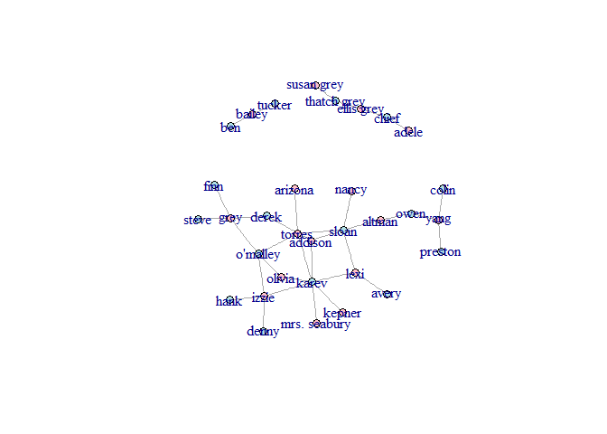
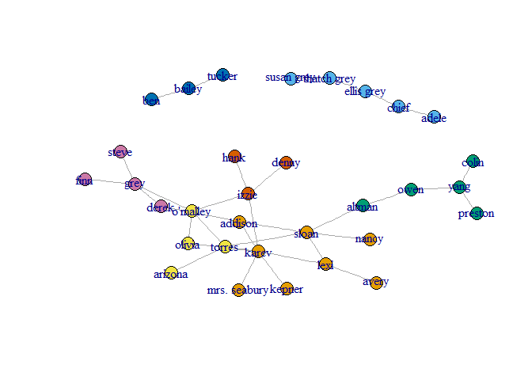
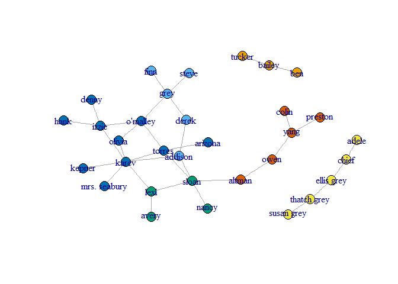
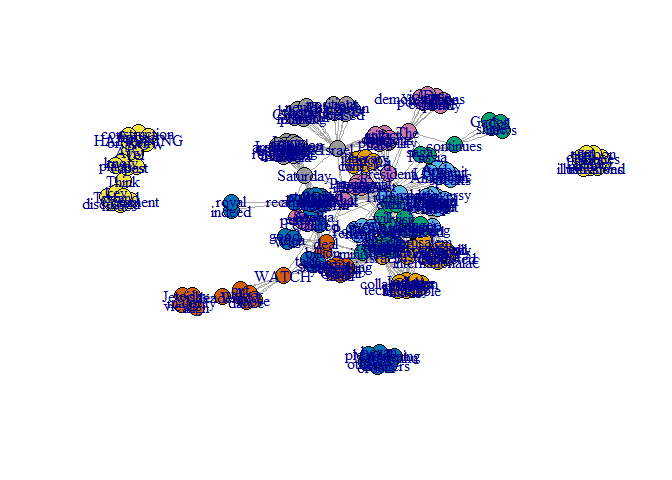

1a.
===

define root directiry and add library

Next, I will explore the data firther. In order to do so, let's
represent the data as a graph. edges - ga.data verices -
ge.data.vertices

    ga.data <- read.csv('C:/Users/User/Desktop/EX3/ga_edgelist.csv', header=T, stringsAsFactors=F)
    ga.data.vertices <- read.csv('C:/Users/User/Desktop/EX3/ga_actors.csv', header=T, stringsAsFactors=F)
    g <- graph.data.frame(ga.data, vertices=ga.data.vertices, directed=F)
    #let's explore it a bit
    g

    ## IGRAPH UN-- 32 34 -- 
    ## + attr: name (v/c), gender (v/c)
    ## + edges (vertex names):
    ##  [1] lexi    --sloan        karev   --lexi         owen    --yang        
    ##  [4] altman  --owen         sloan   --torres       altman  --sloan       
    ##  [7] arizona --torres       karev   --torres       derek   --grey        
    ## [10] izzie   --karev        izzie   --o'malley     o'malley--torres      
    ## [13] colin   --yang         preston --yang         karev   --kepner      
    ## [16] addison --sloan        addison --karev        addison --derek       
    ## [19] nancy   --sloan        karev   --olivia       olivia  --o'malley    
    ## [22] grey    --o'malley     karev   --mrs. seabury adele   --chief       
    ## + ... omitted several edges

We can see that there are 34 edges and 32 vertices on an undirected
graph. Let's use 'V(g)$gender' attribute to color the nodes by gender:

    V(g)$size <- 7 # Set size to all nodes
    V(g)$color <- "powderblue"
    females <- which(V(g)$gender == "F")
    V(g)$color[females] <- "pink" 
    plot(g)

betweeness
----------

For every pair of vertices in a connected graph, there exists at least
one shortest path between the vertices such that either the number of
edges that the path passes through (for unweighted graphs) or the sum of
the weights of the edges (for weighted graphs) is minimized. The
betweenness centrality for each vertex is the number of these shortest
paths that pass through the vertex. \#\#\# highest - sloan = 115.36667

    betweenness <- betweenness(g)
    betweenness <- sort(betweenness, decreasing = TRUE)
    betweenness

    ##        sloan        karev       altman       torres         owen 
    ##    115.36667     95.26667     76.00000     67.15000     60.00000 
    ##     o'malley        izzie         grey      addison         yang 
    ##     54.41667     47.95000     46.86667     44.08333     43.00000 
    ##         lexi        derek       olivia   ellis grey        chief 
    ##     36.00000     17.95000      4.95000      4.00000      3.00000 
    ##  thatch grey       bailey        adele      arizona        avery 
    ##      3.00000      1.00000      0.00000      0.00000      0.00000 
    ##          ben        colin        denny         finn         hank 
    ##      0.00000      0.00000      0.00000      0.00000      0.00000 
    ##       kepner mrs. seabury        nancy      preston        steve 
    ##      0.00000      0.00000      0.00000      0.00000      0.00000 
    ##   susan grey       tucker 
    ##      0.00000      0.00000

Closeness
---------

Closeness is based on the length of the average shortest path between a
node and all other nodes in the network. \#\#\# highest - torres =
0.00319488

    closeness <- closeness(g, mode="all")
    closeness <- sort(closeness, decreasing = TRUE)
    closeness

    ##       torres      addison        karev        sloan     o'malley 
    ##  0.003194888  0.003174603  0.003174603  0.003174603  0.003134796 
    ##         lexi        izzie       altman        derek       olivia 
    ##  0.003115265  0.003076923  0.003039514  0.003039514  0.003039514 
    ##         grey      arizona       kepner mrs. seabury        nancy 
    ##  0.003003003  0.002985075  0.002967359  0.002967359  0.002967359 
    ##        avery         owen        denny         hank         finn 
    ##  0.002915452  0.002898551  0.002881844  0.002881844  0.002816901 
    ##        steve         yang        colin      preston   ellis grey 
    ##  0.002816901  0.002754821  0.002597403  0.002597403  0.001149425 
    ##        chief  thatch grey        adele   susan grey       bailey 
    ##  0.001148106  0.001148106  0.001144165  0.001144165  0.001075269 
    ##          ben       tucker 
    ##  0.001074114  0.001074114

Eigenvector
-----------

How central you are depends on how central your neighbors are. \#\#\#
highest - kerev = 1

    Eigenvector <- eigen_centrality(g, directed = TRUE, scale = TRUE)
    Eigenvector <- sort(Eigenvector$vector, decreasing = TRUE)
    Eigenvector

    ##        karev       torres        sloan     o'malley        izzie 
    ## 1.000000e+00 7.178773e-01 6.418121e-01 6.006975e-01 5.653959e-01 
    ##      addison         lexi       olivia         grey mrs. seabury 
    ## 5.537364e-01 5.255806e-01 4.685192e-01 3.004927e-01 2.926969e-01 
    ##       kepner        derek      arizona       altman        nancy 
    ## 2.926969e-01 2.500302e-01 2.101205e-01 2.077024e-01 1.878564e-01 
    ##        denny         hank        avery         finn        steve 
    ## 1.654896e-01 1.654896e-01 1.538358e-01 8.795329e-02 8.795329e-02 
    ##         owen         yang      preston        colin  thatch grey 
    ## 6.780381e-02 2.394956e-02 7.009961e-03 7.009961e-03 9.419699e-17 
    ##   ellis grey        chief   susan grey        adele       tucker 
    ## 6.638536e-17 5.343310e-17 4.108735e-17 3.630944e-17 2.619702e-17 
    ##          ben       bailey 
    ## 2.298886e-17 1.451190e-17

1b.
===

Girvan-Newman - edge betweeness community Clustering
----------------------------------------------------

we got 7 groups

    gnc <-  edge.betweenness.community(g, directed = FALSE)
    gnc_plot <- membership(gnc)
    gnc

    ## IGRAPH clustering edge betweenness, groups: 7, mod: 0.58
    ## + groups:
    ##   $`1`
    ##   [1] "addison"      "avery"        "karev"        "kepner"      
    ##   [5] "lexi"         "mrs. seabury" "nancy"        "sloan"       
    ##   
    ##   $`2`
    ##   [1] "adele"       "chief"       "ellis grey"  "susan grey"  "thatch grey"
    ##   
    ##   $`3`
    ##   [1] "altman"  "colin"   "owen"    "preston" "yang"   
    ##   
    ##   + ... omitted several groups/vertices

    plot(g, vertex.size=7, vertex.color=gnc_plot, asp=FALSE)

To get the size of each group, we will do: 8,5,5,4,3,3,4

    sizes(gnc)

    ## Community sizes
    ## 1 2 3 4 5 6 7 
    ## 8 5 5 4 3 3 4

### Modularity Score

= 0.5774221

    max(gnc$modularity)

    ## [1] 0.5774221

Louvain Clustering
------------------

We got 6 groups

    lo <- cluster_louvain(g)
    lo_plot <-membership(lo)
    lo

    ## IGRAPH clustering multi level, groups: 6, mod: 0.59
    ## + groups:
    ##   $`1`
    ##   [1] "bailey" "ben"    "tucker"
    ##   
    ##   $`2`
    ##   [1] "addison" "derek"   "finn"    "grey"    "steve"  
    ##   
    ##   $`3`
    ##   [1] "avery" "lexi"  "nancy" "sloan"
    ##   
    ##   $`4`
    ##   + ... omitted several groups/vertices

    plot(g,vertex.size=7 , vertex.color=lo_plot , asp=FALSE)

To get the size of each group, we will do: 3,5,4,5,10,5

    sizes(lo)

    ## Community sizes
    ##  1  2  3  4  5  6 
    ##  3  5  4  5 10  5

### Modularity Score

= 0.5947232

    max(lo$modularity)

    ## [1] 0.5947232

2a.
===

Facebook
--------

Setting credentials. I chose the Facebook page of Jerusalem and took 30
posts up until 22th of may.

    #install.packages("devtools")
    library(devtools)
    #install_github("Rfacebook", "pablobarbera", subdir="Rfacebook")
    require (Rfacebook)

    ## Loading required package: Rfacebook

    ## Loading required package: httr

    ## Loading required package: rjson

    ## Loading required package: httpuv

    ## 
    ## Attaching package: 'Rfacebook'

    ## The following object is masked from 'package:methods':
    ## 
    ##     getGroup

    token <- "EAACEdEose0cBAGdDLYyAdodI4XDWxChmDsaK0Bf0yyragG3926qAZCZBcJAvJEq9Xmd0bFib12Q7zSNNyalTXRFdfWc9ZBiPO1VnwCkRoAKNjY6mZCI9xxAM4VKEd0DTZAcoClU12xVRojB4XrIj14yBrwYkAmdq0v3IzDiZCo7ZB7RWBqhoqgXisXgDeqtaZAcZD"

    fb_page <- getPage('TheJerusalemPost', token, n = 30, since = NULL, until =  "2017-05-22", feed = TRUE,  reactions = FALSE)

    ## 25 posts 50 posts

    head(fb_page )

    ##           from_id                      from_name
    ## 1 159050394216641 The Jerusalem Post / JPost.com
    ## 2 159050394216641 The Jerusalem Post / JPost.com
    ## 3 159050394216641 The Jerusalem Post / JPost.com
    ## 4 159050394216641 The Jerusalem Post / JPost.com
    ## 5 159050394216641 The Jerusalem Post / JPost.com
    ## 6 159050394216641 The Jerusalem Post / JPost.com
    ##                                                                                                                                                         message
    ## 1 Trump<U+0092>s trip comes as the issue of Israeli sovereignty over Jerusalem in general and the Old City specifically has been hotly contested by the international<U+0085>
    ## 2                                                <U+0093>The Temple Mount and the Western Wall will always remain under Israeli sovereignty,<U+0094> the prime minister said.
    ## 3                                                                               Pollard could be Trump's ticket to redemption in the eyes of the Israeli right.
    ## 4                                                                      Today's cartoon by Dry Bones\nLike the page to get daily illustrations on your newsfeed.
    ## 5                                                                                                      Was the $350 billion deal with Saudi Arabia a good idea?
    ## 6                                                        What do you think of the gift President Donald J. Trump will receive from Israel's Holocaust memorial?
    ##               created_time  type
    ## 1 2017-05-21T23:29:17+0000  link
    ## 2 2017-05-21T21:31:26+0000  link
    ## 3 2017-05-21T18:57:26+0000  link
    ## 4 2017-05-21T17:32:00+0000 photo
    ## 5 2017-05-21T16:52:56+0000  link
    ## 6 2017-05-21T15:22:13+0000  link
    ##                                                                                                                                    link
    ## 1                 http://www.jpost.com/Arab-Israeli-Conflict/Analysis-Why-a-photo-op-of-PM-and-Trump-at-the-Western-Wall-matters-492477
    ## 2                  http://www.jpost.com/Israel-News/Netanyahu-ahead-of-Trump-visit-Israel-didnt-occupy-Jerusalem-we-liberated-it-492474
    ## 3                http://www.jpost.com/Israel-News/Politics-And-Diplomacy/Pollard-to-Netanyahu-Dont-forget-me-in-talks-with-Trump-492463
    ## 4                     https://www.facebook.com/TheJerusalemPost/photos/a.167063636748650.35351.159050394216641/1433135113474823/?type=3
    ## 5 http://www.jpost.com/Israel-News/Politics-And-Diplomacy/Ministers-concerned-Saudi-arms-deal-might-affect-Israels-military-edge-492447
    ## 6                           http://www.jpost.com/Israel-News/Yad-Vashem-to-present-President-Trump-with-unique-personal-artifact-492415
    ##                                 id story likes_count comments_count
    ## 1 159050394216641_1433642016757466  <NA>          75             11
    ## 2 159050394216641_1433536563434678  <NA>        2325             91
    ## 3 159050394216641_1433392040115797  <NA>         145             19
    ## 4 159050394216641_1433135113474823  <NA>        1009             47
    ## 5 159050394216641_1433260270128974  <NA>         122             82
    ## 6 159050394216641_1433131736808494  <NA>         159             71
    ##   shares_count
    ## 1           21
    ## 2          534
    ## 3           23
    ## 4          644
    ## 5           52
    ## 6           31

Let's keep the messages and take a look at them

    #install.packages(tm)
    #install.packages(httr)
    #install.packages("slam")
    library(tm)

    ## Loading required package: NLP

    ## 
    ## Attaching package: 'NLP'

    ## The following object is masked from 'package:httr':
    ## 
    ##     content

    library(httr)

    data_posts <- Corpus(VectorSource(fb_page$message))
    data_posts

    ## <<SimpleCorpus>>
    ## Metadata:  corpus specific: 1, document level (indexed): 0
    ## Content:  documents: 30

Let's clean and clear the messages a bit and perform better our data as
a matrix

    term_matrix <- TermDocumentMatrix(data_posts, control = list(removeNumbers=TRUE, removePunctuation=TRUE,stopwords=TRUE,tolower = FALSE)) 
    term_matrix

    ## <<TermDocumentMatrix (terms: 219, documents: 30)>>
    ## Non-/sparse entries: 269/6301
    ## Sparsity           : 96%
    ## Maximal term length: 15
    ## Weighting          : term frequency (tf)

    term_matrix <- as.matrix(term_matrix)
    term_matrix[0:15,]

    ##                  Docs
    ## Terms             1 2 3 4 5 6 7 8 9 10 11 12 13 14 15 16 17 18 19 20 21 22
    ##   City            1 0 0 0 0 0 0 0 0  0  0  0  0  0  0  0  0  0  0  0  0  0
    ##   Israeli         1 1 1 0 0 0 0 0 1  0  1  0  0  0  1  0  0  0  0  0  0  0
    ##   Jerusalem       1 0 0 0 0 0 0 0 0  0  0  1  0  0  0  0  0  0  0  0  0  0
    ##   Old             1 0 0 0 0 0 0 0 0  0  0  0  0  0  0  0  0  0  0  0  0  0
    ##   Trumpâ<U+0080><U+0099>s       1 0 0 0 0 0 0 0 0  0  0  0  0  0  0  0  0  0  0  0  0  0
    ##   comes           1 0 0 0 0 0 0 0 0  0  0  0  0  0  0  0  0  0  0  0  0  0
    ##   contested       1 0 0 0 0 0 0 0 0  0  0  0  0  0  0  0  0  0  0  0  0  0
    ##   general         1 0 0 0 0 0 0 0 0  0  0  0  0  0  0  0  0  0  0  0  0  0
    ##   hotly           1 0 0 0 0 0 0 0 0  0  0  0  0  0  0  0  0  0  0  0  0  0
    ##   internationalâ<U+0080> 1 0 0 0 0 0 0 0 0  0  0  0  0  0  0  0  0  0  0  0  0  0
    ##   issue           1 0 0 0 0 0 0 0 0  0  0  0  0  0  0  0  0  0  0  0  0  0
    ##   sovereignty     1 1 0 0 0 0 0 0 0  0  0  0  0  0  0  0  0  0  0  0  0  0
    ##   specifically    1 0 0 0 0 0 0 0 0  0  0  0  0  0  0  0  0  0  0  0  0  0
    ##   trip            1 0 0 0 0 0 0 0 0  0  0  0  0  0  0  0  0  0  0  0  0  0
    ##   Mount           0 1 0 0 0 0 0 0 0  0  0  0  0  0  0  0  0  0  0  0  0  0
    ##                  Docs
    ## Terms             23 24 25 26 27 28 29 30
    ##   City             0  0  0  0  0  0  0  0
    ##   Israeli          0  0  0  0  0  0  0  0
    ##   Jerusalem        0  0  0  0  0  0  0  0
    ##   Old              0  0  0  0  0  0  0  0
    ##   Trumpâ<U+0080><U+0099>s        0  0  0  0  0  0  0  0
    ##   comes            0  0  0  0  0  0  0  0
    ##   contested        0  0  0  0  0  0  0  0
    ##   general          0  0  0  0  0  0  0  0
    ##   hotly            0  0  0  0  0  0  0  0
    ##   internationalâ<U+0080>  0  0  0  0  0  0  0  0
    ##   issue            0  0  0  0  0  0  0  0
    ##   sovereignty      0  0  0  0  0  0  0  0
    ##   specifically     0  0  0  0  0  0  0  0
    ##   trip             0  0  0  1  0  0  0  0
    ##   Mount            0  0  0  0  0  0  0  0

Now, let's create the graph

    #install.packages("igraph")
    library(igraph)

    net <- graph.incidence(term_matrix)
    proj_net <- bipartite.projection(net)
    net <- proj_net$proj1
    #set.seed(3952)
    plot(net)

and beautify it a bit

    degree_s<-degree(net)
    V(net)$label <- V(net)$name
    V(net)$size = degree(net)
    V(net)$size <- degree_s * 0.2
    V(net)$label.cex<-  2 * V(net)$size / max(V(net)$size) +.2
    plot(net)

    #install.packages('wordcloud')
    #install.packages(' RColorBrewer')
    library(wordcloud)

    ## Loading required package: RColorBrewer

    library(RColorBrewer)
    #Layout<-layout_with_kk(net)
    #Layout<-layout_with_lgl(net)
    #Layout<-layout_nicely(net)
    plot(net, asp=FALSE)

    summary(net)

    ## IGRAPH UNW- 219 1230 -- 
    ## + attr: name (v/c), label (v/c), size (v/n), label.cex (v/n),
    ## | weight (e/n)

    #tkplot(net, layout=Layout)

Now, I will answer question 1 a again and will find Bteweennes, Closeness and Eigenvector
-----------------------------------------------------------------------------------------

### Betweeness, Trump = 6138.41

    betweenness<-betweenness(net)
    betweenness = sort(betweenness, decreasing = TRUE)
    #betweenness
    head(betweenness)

    ##    Trump  Israeli   Israel    WATCH     will      The 
    ## 6138.410 4077.899 3878.596 1870.000 1726.098 1607.538

### Closness , Israel = 1.186662e-04

    closeness<-closeness(net)
    closeness = sort(closeness, decreasing = TRUE)
    #closeness
    head(closeness)

    ##        Trump      Israeli       United       Israel         will 
    ## 0.0001186662 0.0001181474 0.0001177718 0.0001177579 0.0001177440 
    ##     Saturday 
    ## 0.0001175779

### Eigenvector , Trump=1

    Eigenvector <- eigen_centrality(net, directed = TRUE, scale = TRUE)
    Eigenvector <- sort(Eigenvector$vector, decreasing = TRUE)
    #Eigenvector
    head(Eigenvector)

    ##     Trump      will   Israeli    Donald     first      trip 
    ## 1.0000000 0.6586115 0.5324080 0.5040862 0.4982348 0.4698301

1 b
===

Community detection
-------------------

### Girvan-Newman- there are 15 groups

    net_new <- proj_net$proj1
    net_new

    ## IGRAPH UNW- 219 1230 -- 
    ## + attr: name (v/c), weight (e/n)
    ## + edges (vertex names):
    ##  [1] City   --Israeli         City   --Jerusalem      
    ##  [3] City   --Old             City   --Trumpâ<U+0080><U+0099>s      
    ##  [5] City   --comes           City   --contested      
    ##  [7] City   --general         City   --hotly          
    ##  [9] City   --internationalâ<U+0080> City   --issue          
    ## [11] City   --sovereignty     City   --specifically   
    ## [13] City   --trip            Israeli--Jerusalem      
    ## [15] Israeli--Old             Israeli--Trumpâ<U+0080><U+0099>s      
    ## + ... omitted several edges

    gnc_net <-  edge.betweenness.community(net_new, directed = FALSE)
    gnc_net_plot <- membership(gnc_net)
    gnc_net

    ## IGRAPH clustering edge betweenness, groups: 15, mod: 0.71
    ## + groups:
    ##   $`1`
    ##    [1] "City"            "Israeli"         "Jerusalem"      
    ##    [4] "Old"             "Trumpâ<U+0080><U+0099>s"       "comes"          
    ##    [7] "contested"       "general"         "hotly"          
    ##   [10] "internationalâ<U+0080>" "issue"           "sovereignty"    
    ##   [13] "specifically"    "Indian"          "collaboration"  
    ##   [16] "huge"            "incredible"      "just"           
    ##   [19] "made"            "navy"            "price"          
    ##   [22] "public"          "sticker"         "technology"     
    ##   
    ##   + ... omitted several groups/vertices

    plot(net_new, vertex.size=7, vertex.color=gnc_net_plot, asp=FALSE)

size = 24 22 20 10 21 9 10 30 5 6 7 19 8 12 16
----------------------------------------------

### modularity= 0.7144406

    sizes(gnc_net)

    ## Community sizes
    ##  1  2  3  4  5  6  7  8  9 10 11 12 13 14 15 
    ## 24 22 20 10 21  9 10 30  5  6  7 19  8 12 16

    max(gnc_net$modularity)

    ## [1] 0.7144406

Louvain Clustering - We've got 16 groups
----------------------------------------

    lo_net <- cluster_louvain(net_new)
    lo_net_plot <-membership(lo_net)
    lo_net

    ## IGRAPH clustering multi level, groups: 12, mod: 0.72
    ## + groups:
    ##   $`1`
    ##    [1] "Bones"         "Dry"           "Like"          "Today"        
    ##    [5] "cartoon"       "daily"         "get"           "illustrations"
    ##    [9] "newsfeed"      "page"         
    ##   
    ##   $`2`
    ##    [1] "trip"        "Pollard"     "Trump"       "eyes"       
    ##    [5] "redemption"  "right"       "ticket"      "Donald"     
    ##    [9] "American"    "Arab"        "Islamic"     "LIVE"       
    ##   [13] "Summit"      "speaks"      "first"       "Comey"      
    ##   + ... omitted several groups/vertices

    plot(net_new,vertex.size=7 , vertex.color=lo_net_plot , asp=FALSE)

size = 10 28 11 33 8 19 15 27 27 10 23 8
----------------------------------------

### modularity= 0.7218966

    sizes(lo_net)

    ## Community sizes
    ##  1  2  3  4  5  6  7  8  9 10 11 12 
    ## 10 28 11 33  8 19 15 27 27 10 23  8

    max(lo_net$modularity)

    ## [1] 0.7218966
